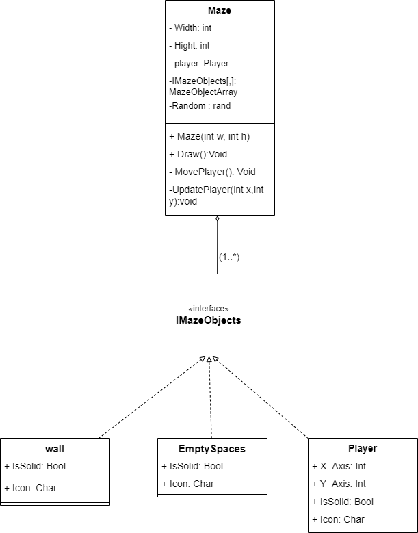

# Maze Game

Welcome to the Maze Game repository! Maze Game is a C# console-based game where players navigate a randomly generated maze using arrow keys. The objective is to find the exit, which is always reachable. This project demonstrates basic game mechanics, maze generation, and user input handling in C# using Object-Oriented Programming (OOP) principles.

## Project Overview

### Game Features

- **Maze Generation**: A random maze is generated each time the game starts with a mix of walls and empty spaces.
- **Player Movement**: The player moves through the maze using the arrow keys on the keyboard.
- **Exit**: The goal is to reach the designated exit point within the maze.
- **Console Interface**: The game is played in the console, and the player is represented by an `@` symbol.

### Technologies

- **Programming Language**: C#
- **Development Environment**: Visual Studio

### Object-Oriented Programming (OOP)

This project employs OOP principles to create a well-structured and maintainable codebase:

- **Encapsulation**: Classes like `Player`, `Maze`, and `Wall` encapsulate data and methods related to their respective functionalities. For instance, the `Player` class manages the player's position and icon, while the `Maze` class handles maze generation and drawing.

- **Abstraction**: The `IMazeObjects` interface abstracts common functionalities of maze elements like walls and empty spaces. This allows for a flexible design where different types of maze objects can be managed through a common interface.

- **Inheritance**: The `Wall` and `EmptySpaces` classes inherit from the `IMazeObjects` interface, allowing them to be used interchangeably in the maze without altering the core logic.

- **Polymorphism**: Through the use of the `IMazeObjects` interface, the code demonstrates polymorphism by treating different maze objects uniformly, which simplifies the handling of various types of objects within the maze.

- **Player Class**: The `Player` class is designed to represent the player within the maze. It encapsulates the player's position and icon, and provides methods for updating the player's position based on user input. This class demonstrates encapsulation and abstraction by managing the player-specific logic separately from the maze logic.

## Usage

- **Arrow Keys**: Move the player up, down, left, or right.
- **Objective**: Reach the exit located at `(width - 2, height - 2)`.

## Code Structure

- **`Program.cs`**: Entry point for the game.
- **`Maze.cs`**: Contains the logic for maze generation, drawing, and player movement.
- **`Player.cs`**: Defines the player and their properties.
- **`IMazeObjects.cs`**: Interface for maze objects like walls and empty spaces.
- **`EmptySpaces.cs`**: Represents empty spaces in the maze.
- **`Wall.cs`**: Represents walls in the maze.

## UML Diagram

## License

This project is licensed under the MIT License - see the [LICENSE](LICENSE) file for details.

## Contact

For any questions or feedback, feel free to contact me via [GitHub Issues](https://github.com/dinaiprahem/MazeGame/issues).
